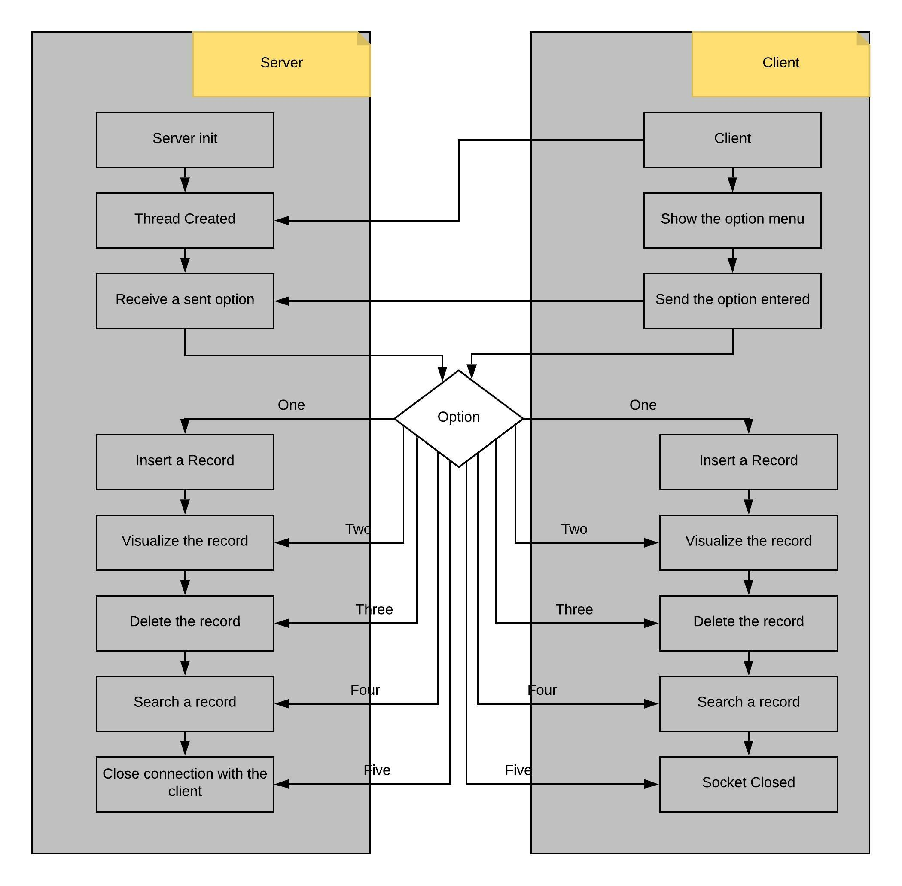
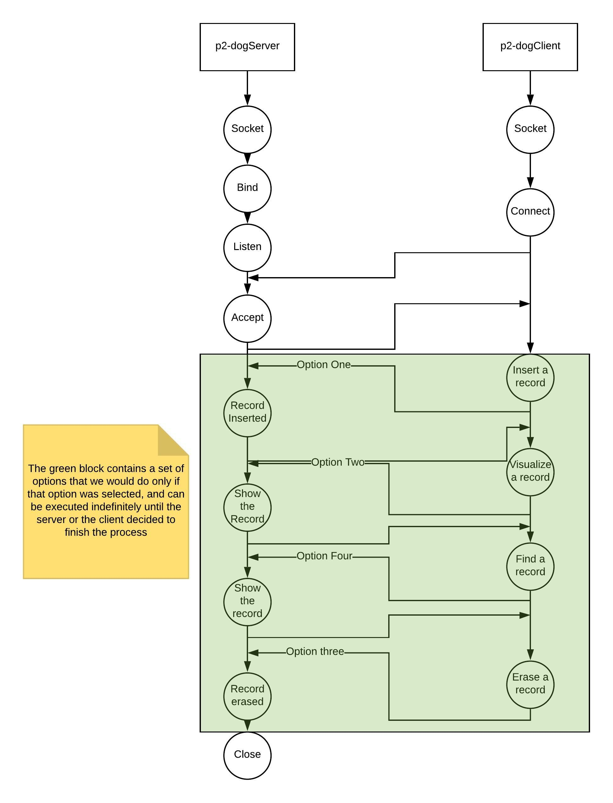

# Production Report

## Functions

### Definitions in "pet_globals.h"

- **T_SIZE:** size of the hashtable used in memory.

- **PATH:** relative path of the file used as database.

- *typedef struct dogType:* structure for soring all relevant information of a pet record.

- *typedef struct node:* structure stored in the h-table, for finding *dogType* structs in the database file.

### Functions in "randomStructs.c":

- inserting:  Reads the FileName and puts the data (words separated by breaklines) inside the data array.

- randomStructs: Put a "numberPets" structs inside dataDogs.dat File using random data generated using the "names", "breeds" and "types" data arrays.

### Functions in "error_handle.c"

- sys_error(char \*msg): Function for abreviating printing a message, last errno, and exiting with failure code.

### Functions in "pet_file.c":

- **set_total_lines(int n):** sets the database-global line counter to [n].

- **add_pet_from_line(FILE \*db, dogType \*pet, int firstln):** Searches the end of the in-disk linked list that starts at [firstln] in [db] and appends [pet] to it.

- **append_pet(FILE \*db, dogType \*pet):** Appends [pet] to the very end of [db] and returns the line number that it now occupies

- **get_total_lines():** Returns number of lines in the file.

- **read_pet_at_line(FILE \*db, dogType \*pet, int line):** Fill the information of a pet from the line number [line] in [db] into [pet].

- **del_pet(FILE \*db, int line, delResult \*res):** Removes the structure in the line# [line] in [db], and reports the modifications to do in the h-table.

- *typedef struct delResult:* Struct for collecting all the information to update the h-table after a deletion in the file.

### Functions in "pet_hashtable.c":

- **init_table(node \*table, FILE \*db):** Reads all the structures in [db] and records the line number for a given linked list in the h-table [table]. Returns the number of structs loaded on success, -1 otherwise.

- **get_line(node \*table, char \*name):** Returns the line value for the key [name] in [table], or -1 if [name] wasn't found

- **update_line(node \*table, char \*name, int newln):** Updates the value in [table] for the key [name] with the value [newln]. Returns 1 on success, 0 on failure

- **delete_line(node \*table, char \*name):** Deletes value [name] from [table]. Returns 1 on success, 0 on failure.

- **insert_new_line(node \*table, char \*name, int line):** Inserts the value [line] for the key [name] in [table]. Returns the index in the table, or -1 if it was duplicated

### Functions in "pet_input.c":

- **word_to_upper(char \*word):** Transforms the alphabetic chars in a string to uppercase, in place

- **fill_pet_info(dogType \*pet):** Uses stdin to get all info for a pet record. Handles invalid input by 'asking' again

- **get_bounded_str(char \*buffer, unsigned int bound):** Read a line up to [bound] chars. If the line is too long, truncates it and returns 0

- **get_int(char \*msg):** Get a non-negative int from stdin

- **confirmation(char \*msg):** Easily ask for a yes/no question in stdin

- **cfileexists(const char\* filename):** Indicates 1 if the file exist or 0 otherwise.

### Functions in "pet_output.c":

- **print_list(FILE \*db, int line):** Prints all dogType structs in the same linked list at [db] starting with the one at [line].

- **print_pet(dogType \*pet):** Prints the fields of the [pet] struct to stdin.

- **print_pet_debug(dogType \*pet):** Prints the fields of the [pet] struct to stdin, including info related to the implementation of on-disk linked lists.

- **open_medical_record(int doc_id):** Opens a medical record identified with [doc_id] in a text editor.

- **fill_new_mr(FILE \*file, dogType \*pet):** Puts the basic info of a [pet] in a medical record [file].

### Functions in "sock_aux.c":

- **send_full(int sockfd, void \*buff, int size):** Sends through the socket identified with [sockfd] [size] bytes pointed by [buff], making sure to send all.

- **recv_full(int sockfd, void \*buff, int size):** Receives through the socket identified with [sockfd] exactly [size] bytes pointed by [buff], making sure to get all.

- **send_pet_list(FILE \*db, int sockfd, int line):** Sends the structs belonging to the linked list that starts in [db]'s [line] line and sends them through [sockfd]. Then sends a last struct with field sex == 'E'.

- **send_file(FILE \*file, int sockfd):** Sends the contents of [file] through [sockfd] socket.

- **recv_write_file(FILE \*file, int sockfd):** Gets bytes through [sockfd] socket and writes them into [file].

## Block Diagram

## Comunications Diagram

